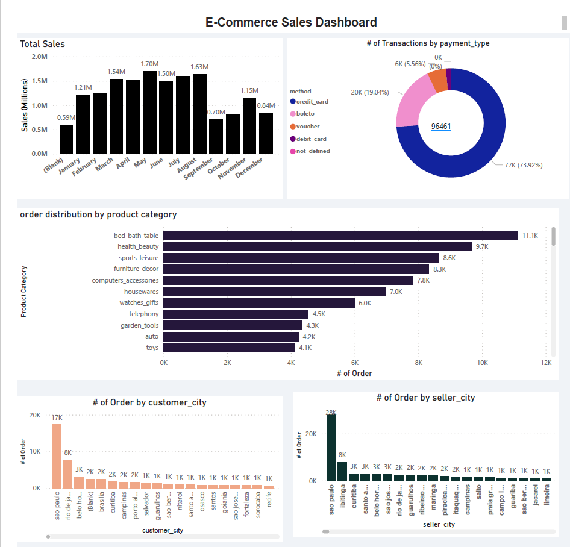

# Brazilian E-Commerce by Olist
### Project Overview
This is a public dataset on Kaggle Platform. It was generously provided by Olist which is the largets department store in Brazil. Small businesses are connected by Olist across Brazil to channels without hassle and with a single contract.
Those small business can sell their products through the Olist Store and products are directly shipped to the customers by Olist logistics partners. See more details on the website: www.olist.com.
After a customer place his order from Olist Store, notification sent to seller to let seller complete that order. Once customer receive their product, or after the delivery date, customer could fill in a satisfaction survey by email where he could write down his purchase experience and comments. 
[here](Link https://www.kaggle.com/datasets/olistbr/brazilian-ecommerce)

### Codes and Resources Used
* DataSpell
* Python 3.8

### Python Packages Used
* General Purpose: 
* Data Manipulation: pandas, numpy
* Data Visualization: seaborn, matplotlib
* Machine Learning: sklearn

####  Data Schema

### Results and evaluation

### Tasks
#### 1. Data Visualisation

#### 2. Customer Segment
Customer are categorised into various groups. Firstly, customer could be split into New Customer and Regular Customer to see how they purchase products. In addition, RFM segmentation are utilised on customer as well, which is a marketing analysis method that involves analyzing customer behavior based on three key factors: recency, frequency, and monetary value. Later K-Means and DBSCAN methods to categorised customer into various groups.

#### 3. Sentiment Analysis (NLP) 
Reviews left by customers are valuable to improve product quality and service. Bascially, text processing are utilised on customer reviews. Labels are given by their score. In the end, various classification method are used to split reviews into groups and pick up negative feedbacks to improve in order to provide better service.

## Versioning
Github/Git are used for versioning/sharing. 

## Authors

* **James Li** 

## License

This project is licensed under the MIT License - see the [LICENSE.md](LICENSE.md) file for details

## This Project is not completely finished.